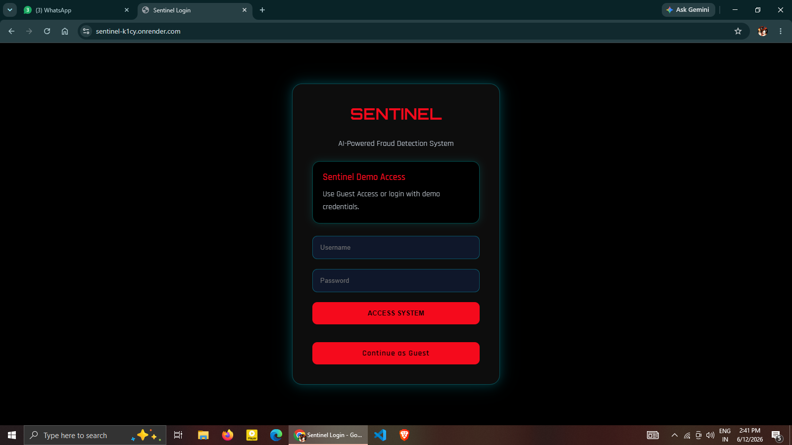
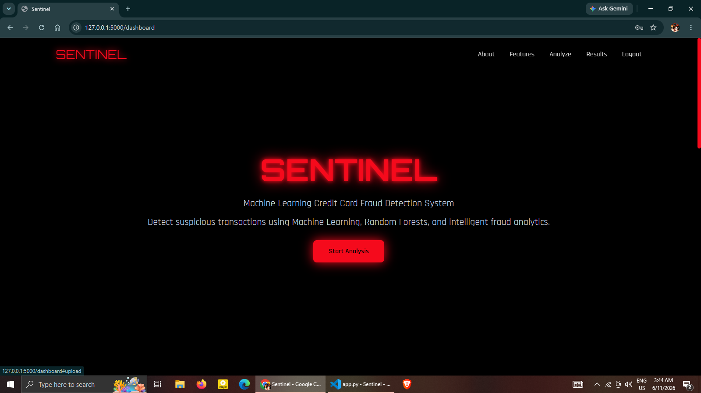
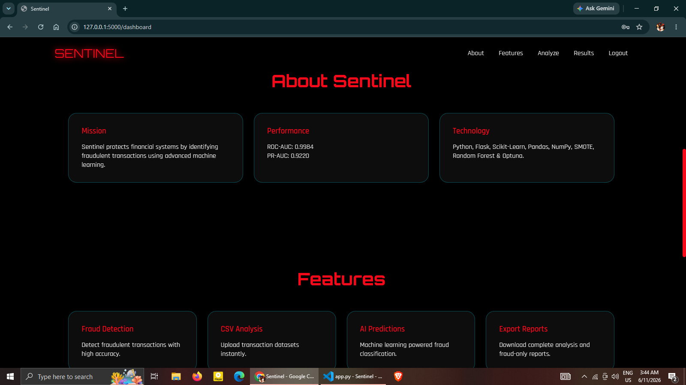
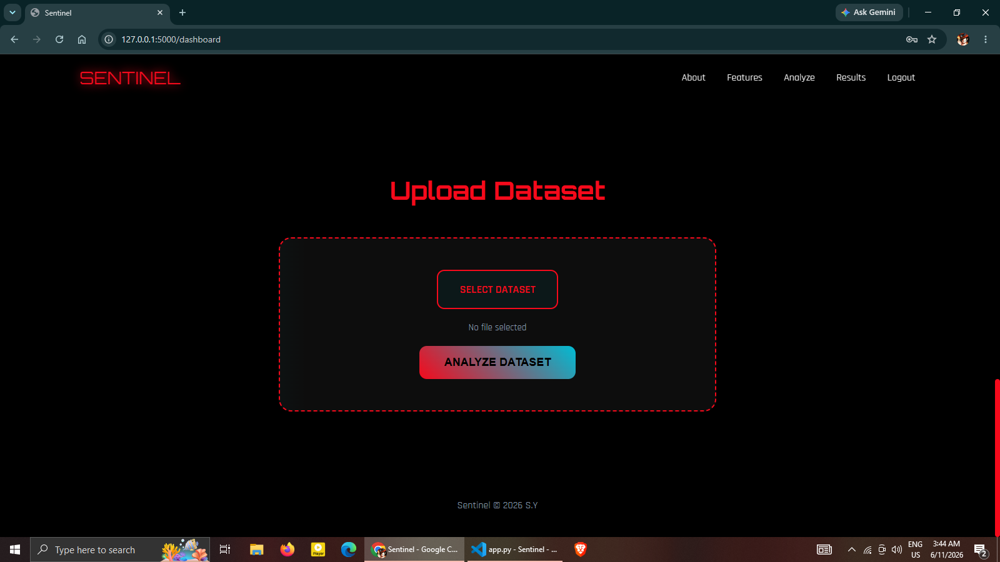
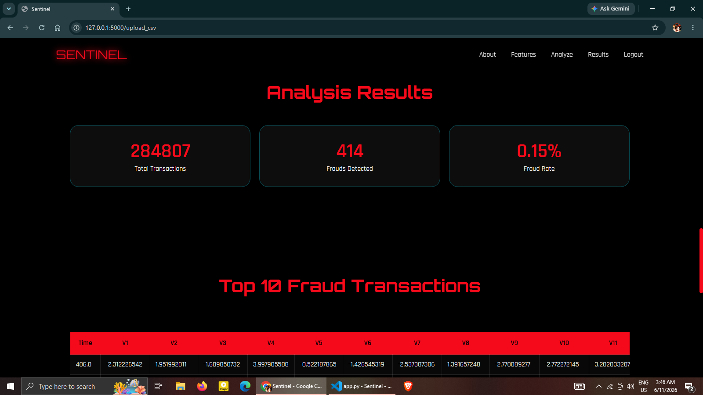
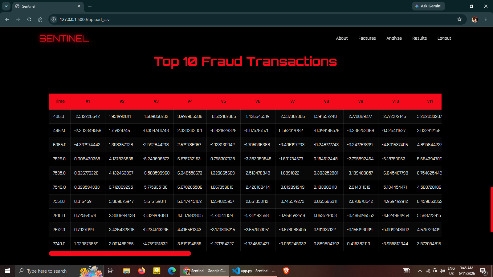
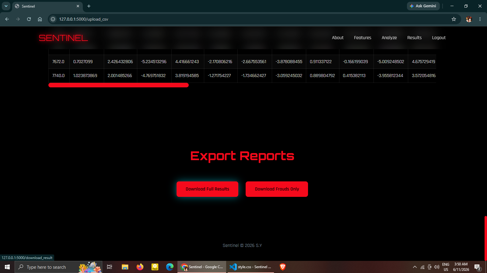

Sentinel — AI-Powered Credit Card Fraud Detection System

Sentinel is an end-to-end machine learning project for detecting fraudulent credit card transactions. It combines a trained fraud-detection model with a Flask-based web application that allows users to upload transaction datasets (CSV files), analyze them, and download both complete results and fraud-only reports.

---
##Live Demo:
[Try Sentinel Live](https://sentinel-k1cy.onrender.com)
---

##Features

- Machine-learning-based fraud detection
- Handles highly imbalanced datasets using SMOTE / undersampling
- Flask web application with authentication
- CSV upload and batch prediction
- Fraud probability scoring
- Downloadable full-results CSV and fraud-only CSV
- Cyberpunk-style dashboard UI for portfolio/demo use

---

##Model Performance

Latest evaluation (Random Forest + tuning):

Metric| Value
ROC-AUC (Receiver Operating Characteristic – Area Under the Curve)| 0.9984
PR-AUC (Precision-Recall – Area Under the Curve)| 0.9220
Fraud Recall| 0.82
Fraud Precision| 0.97

Confusion matrix (threshold 0.5):

```text
[[284304     11]
 [    89    403]]
```

---

##Tech Stack

- Python
- Flask
- Scikit-learn
- Imbalanced-learn (SMOTE)
- Pandas
- NumPy
- Matplotlib
- Optuna (hyperparameter tuning)
- Joblib
- HTML / Jinja2 / CSS

---

## Project Structure

```text
SentinelAI/
│
├── data/
│   └── .gitkeep
├── models/
│   └── .gitkeep
├── reports/
│   └── .gitkeep
├── results/
├── screenshots/
├── src/
│   ├── static/
│   │   ├── style.css
│   │   └── script.js
│   ├── templates/
│   │   ├── login.html
│   │   └── dashboard.html
│   ├── app.py
│   ├── train.py
│   ├── tune.py
│   └── evaluate.py
├── notebook/
│   └── 01_quick_eda.ipynb
├── README.md
├── requirements.txt
└── .gitignore
```
---

##Setup

1. ### Clone the Repository

```bash
git clone https://github.com/SakshamYadav1000/Sentinel.git
cd Sentinel
```

2. Create a virtual environment

Windows (PowerShell):

```powershell
python -m venv venv
.\venv\Scripts\Activate.ps1
```

macOS/Linux:

python -m venv venv
source venv/bin/activate

3. Install dependencies

```bash
pip install -r requirements.txt
```

---

##Running the Web App

From the project root:

```bash
python src/app.py
```

Open:

http://127.0.0.1:5000

Default demo credentials (development only):

Username: admin
Password: password123

---

##Training the Model

Place the Kaggle "creditcard.csv" dataset in the "data/" directory, then run:

python src/train.py --data_path data/creditcard.csv --model random_forest --imbalance smote

This will save:

- "models/fraud_detector.pkl"
- evaluation reports under "reports/"

---

##Hyperparameter Tuning

Fast tuning (recommended first):

python src/tune.py

Extended tuning (slower):

python src/tune_long.py

---

##CSV Input Format

The model expects exactly 30 feature columns corresponding to the training data (all feature columns except the target "Class").

Expected features:

Time, V1, V2, ..., V28, Amount

Do not include the "Class" column when uploading CSVs for prediction.

---

##Output Files

After analysis, Sentinel generates:

- "results/fraud_results.csv" — all transactions with predictions and fraud probabilities
- "results/frauds.csv" — only transactions predicted as fraudulent ("prediction == 1")

These files are gitignored and not committed to the repository.

---

##Notes

- The repository intentionally excludes the dataset and trained model artifacts.
- Train the model locally before running the web app in a fresh clone.
- The current authentication is a simple demo implementation; production deployments should use proper password hashing, environment-based secrets, and database-backed user management.

---

##Screenshots

### Login Page


### Dashboard


### About


### Upload


### Results



### Download


---

##License

This project is intended for educational and portfolio purposes.

---

Made With love ~ S.Y <3